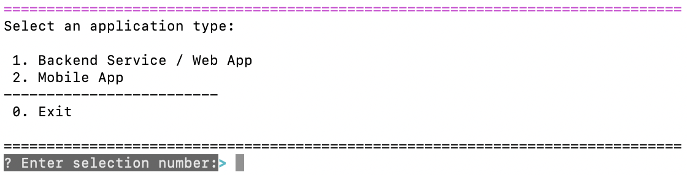
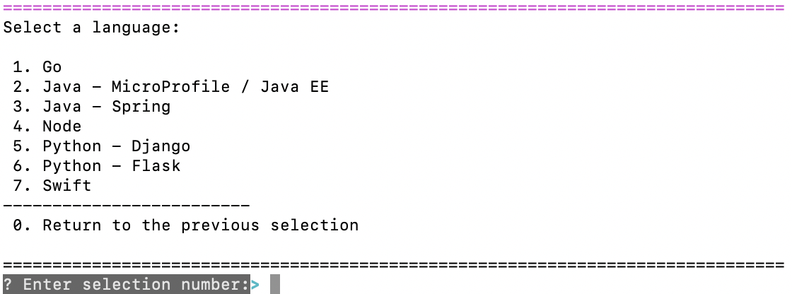
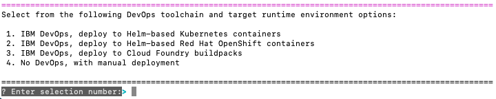
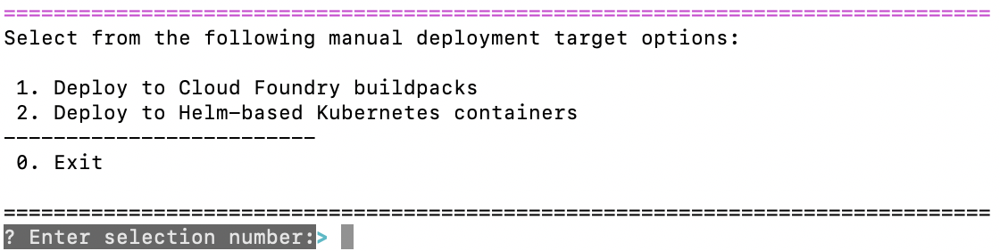

---

copyright:
  years: 2018, 2020
lastupdated: "2020-06-05"

keywords: apps, create, build, deploy, cli, web app, microservice, deploy cli, build app local, developer tools, ibmcloud dev create, knative, openshift, kubernetes, cluster

subcollection: apps

---

{:new_window: target="_blank"}  
{:shortdesc: .shortdesc}  
{:screen: .screen}  
{:codeblock: .codeblock}  
{:pre: .pre}
{:tip: .tip}
{:note: .note}
{:external: target="_blank" .external}

# Creating and deploying apps by using the CLI
{: #create-deploy-app-cli}

You can use the {{site.data.keyword.dev_cli_short}} (`ibmcloud dev`) commands that are included with the {{site.data.keyword.cloud}} CLI to create and deploy your application. The `ibmcloud dev` commands let you use a starter kit or cloud-enable your existing app code.

## Before you begin
{: #prereqs-app-cli}

* You must install the {{site.data.keyword.cloud_notm}} CLI and other recommended plug-ins and tools. For more information, see [Getting started with the IBM Cloud CLI and Developer Tools commands](/docs/cli?topic=cli-getting-started). 
* Docker is installed as part of the developer tools. Docker must be running for the build commands to work. You must create a Docker account, run the Docker app, and sign in.
* If you plan to deploy your app to a Kubernetes or OpenShift cluster, you must create a cluster. For more information, see [Deploying apps to Kubernetes clusters](/docs/containers?topic=containers-app) or [Deploying apps in OpenShift clusters](/docs/openshift?topic=openshift-openshift_apps).
* If you plan to deploy your app by using Knative:
  * Create a paid Kubernetes cluster with at least three worker nodes with 16GM RAM each.
  * Ensure that the Knative and Istio addons are installed into your Kubernetes cluster. For more information, see [Setting up Knative in your cluster](/docs/containers?topic=containers-serverless-apps-knative#knative-setup).
* If you plan to deploy to Cloud Foundry, use [**ibmcloud target --cf**](/docs/cli?topic=cli-ibmcloud_cli#ibmcloud_target) to target the Cloud Foundry org and space interactively, or use [**ibmcloud target --cf-api ENDPOINT -o ORG -s SPACE**](/docs/cli?topic=cli-ibmcloud_cli#ibmcloud_target) to target the specific org and space.

## Creating an app from a starter kit
{: #create-app-cli}

Creating an app from a starter kit is useful if you don't already have existing code to begin with and would rather start from a language or a framework starter template.

1. Run the [**ibmcloud dev create**](/docs/cli?topic=cli-idt-cli#create) command in the directory of your choice.
2. Select an application type of either **Backend Service / Web App** or **Mobile App**.
  {: caption="Figure 1. App types in the CLI" caption-side="bottom"}
3. Select a language.
  {: caption="Figure 2. Languages in the CLI" caption-side="bottom"}
4. Select a starter kit to use as the basis for your app.
5. Enter a name for your app, and select the resource group that you want to use (if necessary).
6. Optional. Select a service to add to your app. During the app creation process, you are prompted if you want to add a service to your app.
  1. Enter **Y**.
  2. Select **Create a new service and add it to this application**.
  3. Follow the prompts to select a service group, service, region, and pricing plan.
7. Select a deployment option. If you want to deploy the app automatically, select a DevOps option. Otherwise, select the manual deployment option.
  {: caption="Figure 3. Deployment options in the CLI" caption-side="bottom"}

    You might need to set up SSH keys to complete this step. If you set a passphrase for your SSH key, you are required to enter this code.
    {: note}
8. If you selected a DevOps deployment option, follow the remaining prompts to select a region for your toolchain, enter a name for the DevOps toolchain, and enter a host name. Otherwise, follow the prompts for a manual deployment.
  {: caption="Figure 4. Manual deployment options in the CLI" caption-side="bottom"}

Creating the app and toolchain takes a few seconds to complete. The app is created in the current directory. Only the deployment files that are relevant for your choice of deployment target are created. You can use the [**ibmcloud dev edit**](/docs/cli?topic=cli-idt-cli#edit) command from the app directory to add more deployment file types if you need them.

## Creating an app from your own code
{: #byoc-cli}

This option can be used if you already have an existing codebase and want to generate deployment and cloud enablement assets for a single microservice or web app by using the [**ibmcloud dev enable**](/docs/cli?topic=cli-idt-cli#enable) command. This command is in beta, and not all languages or app structures are supported. Complete the following steps to use this function with a sample repository.

1. Log in to {{site.data.keyword.cloud_notm}} by running the **ibmcloud login** command, and then target an org and space.
2. Clone the [Hello World sample app](https://github.com/IBM-Cloud/node-helloworld){: external} by running the following command in the directory of your choice.

  ```
  git clone https://github.com/IBM-Cloud/node-helloworld.git
  ```
  {: codeblock}

3. Navigate to the directory where you cloned the sample app, and run the [**ibmcloud dev enable**](/docs/cli?topic=cli-idt-cli#enable) command.
4. Select to continue without committing changes for now (if necessary).
5. Select to continue when you're prompted to proceed with the Node language that is detected.
6. Select the resource group that you want to use (if necessary). 
7. Select the option to create a new {{site.data.keyword.cloud_notm}} app that is linked to this Git repository. See **Important Notes** for details.
8. Choose not to add services for now.
9. Wait a few seconds for the operations to complete. 
10. After the operations are completed, manually merge the deployment and cloud enablement files that are saved to the app directory. Merge new files marked `.merge` by using `git diff` or a similar tool.

 - If you already created an {{site.data.keyword.cloud_notm}} app by using the {{site.data.keyword.cloud_notm}} console, follow steps 2 - 5 in the previous section in your app directory. For step 6, you can select the option to connect your local code to an existing app.
 - To manually configure a toolchain and deployment files, see [Set up a DevOps pipeline for your app to deploy to a cluster](/docs/containers?topic=containers-tutorial-byoc-kube). This tutorial can be useful if you're trying to configure a Continuous Delivery toolchain for more than one interrelated web apps or microservices.
 - If your existing codebase isn't already in a Git repository, follow steps 2 - 5 in the previous section in your app directory. For step 6, you can select the option create a new {{site.data.keyword.cloud_notm}} app, and deploy it to a DevOps toolchain (which has a newly created GitLab repository).

## Building your app and running it locally
{: #build-run-app-cli}

Regardless of which option you used to create your app, you can now build it and run it locally.

1. Navigate to your app directory, and ensure that Docker is running on your system.
2. Run the [**ibmcloud dev build**](/docs/cli?topic=cli-idt-cli#build) command to build your app.
3. Run the [**ibmcloud dev run**](/docs/cli?topic=cli-idt-cli#run) command to start the app in the foreground. To stop the app and return the command prompt, press Ctrl+C.
4. View your app that is running locally by navigating to `http://localhost:3000` or a similar URL.

You can also use [compound commands](/docs/cli?topic=cli-idt-cli#compound), such as **ibmcloud dev build/run**, to sequentially start a build followed by a run.
{: tip}

## Adding a service and modifying the code
{: #resources-app-cli}

Now that your app can run locally, you can add a service and modify some code. 

1. Run the [**ibmcloud dev edit**](/docs/cli?topic=cli-idt-cli#edit) command from the app directory.
2. Follow the prompts to create and connect a new data-related service to your app, such as {{site.data.keyword.cloudant_short_notm}}. You might need to select a region and plan for the service.
3. You can choose to manually merge the configuration files that are saved to your app directory when you create the service. Or you can skip this step for now.
4. Update your code. For example, modify the `/public/index.html` file or a similar file. If you're using the sample `ExpressJS` app, you can change the `Congratulations!` message to something like `Hello World!`.
5. Save any files that you modified.

## Deploying your app
{: #deploy-app-cli}

{{site.data.keyword.cloud_notm}} provides a robust CLI and {{site.data.keyword.dev_cli_short}} (`ibmcloud dev`) commands to help simplify the developer's workflow. You can deploy your {{site.data.keyword.cloud_notm}} app in one of two ways, depending on how your app is configured.

1. Change to the directory where your app code is located.

2.  Update your app code, if necessary. For example, if you're using an {{site.data.keyword.cloud_notm}} sample app and your app contains the `src/main/webapp/index.html` file, you can modify it and edit the `Thanks for creating ...` line. Ensure that the app runs locally before you deploy it to {{site.data.keyword.cloud_notm}}.

  Review the `README.md` file, which contains details, such as build instructions.

  If your app is a Liberty app, you must build it before you deploy it again.
  {: note}

3. Log in to the {{site.data.keyword.cloud_notm}} CLI with your IBMid. If you have multiple accounts, you are prompted to select which account to use. If you do not specify a region with the `-r` flag, you must also select a region.
  ```
  ibmcloud login
  ```
  {: codeblock}
  
  If your credentials are rejected, you might be using a federated ID. To log in with a federated ID, use the `--sso` flag. For more information, see [Logging in with a federated ID](/docs/iam/federated_id?topic=iam-federated_id#federated_id).
  {: tip}

### Deploying your app automatically
{: #deploy-cli-auto}

If you didn't create a DevOps toolchain for your app and your app isn't yet in a Git repository, you can run the [**ibmcloud dev edit**](/docs/cli?topic=cli-idt-cli#edit) command from the app directory. Follow the prompts for "Configure DevOps" and deploy to a new toolchain (and create a new GitLab repository).

After you create a DevOps toolchain for your app, deploying a new build is as simple as committing and pushing your code to the repository in your toolchain. 

1. Prepare the changes to be committed.
    ```
    git add .
    ```
2. Commit the changes with a brief message.
    ```
    git commit -m "made changes"
    ```
3. Push the commits on the master branch to the remote repository.
    ```
    git push origin master
    ```
4. View the DevOps toolchain for your app from the {{site.data.keyword.cloud_notm}} console. You can view toolchain details from the **App details** page in the {{site.data.keyword.cloud_notm}} console by running the [**ibmcloud dev console**](/docs/cli?topic=cli-idt-cli#console) command from the app directory.
5. View the pipeline within the toolchain to verify that a new build started.

### Deploying your app manually
{: #deploy-cli-manual}

When you use [**ibmcloud dev create**](/docs/cli?topic=cli-idt-cli#create), you're prompted to choose between a DevOps deployment or a manual deployment. When you choose the manual deployment option, the app is created and saved into your current directory, but it's not automatically deployed.

You can manually deploy your app to {{site.data.keyword.cloud_notm}} by completing the following steps:

1. Run the [**ibmcloud dev deploy**](/docs/cli?topic=cli-idt-cli#deploy) command.

  For Cloud Foundry:

    ```
    ibmcloud dev deploy
    ```
    {: codeblock}

  For Kubernetes:

    ```
    ibmcloud dev deploy -t container
    ```
    {: codeblock}

If you want to deploy your app to a different manual deployment type, run [**ibmcloud dev edit**](/docs/cli?topic=cli-idt-cli#edit) from the app directory, and add the other deployment files.


### Related information
{: #deploy-cli-related}

For more information about deploying your app to {{site.data.keyword.cloud_notm}} by using the CLI, see:

* [Deploying to {{site.data.keyword.cloud_notm}} environments with {{site.data.keyword.dev_cli_short}} commands](https://www.ibm.com/cloud/blog/deploying-to-ibm-cloud-environments-with-ibm-cloud-developer-tools-cli){: external}

## Viewing your app
{: #view-app-cli}

1. To view the URL of your app that's running on {{site.data.keyword.cloud_notm}}, run the [**ibmcloud dev view**](/docs/cli?topic=cli-idt-cli#view) command from the app directory. The app URL is opened in your default browser.
2. To view details about your app's credentials, services, and toolchain from the {{site.data.keyword.cloud_notm}} console, run the [**ibmcloud dev console**](/docs/cli?topic=cli-idt-cli#console) command. 
