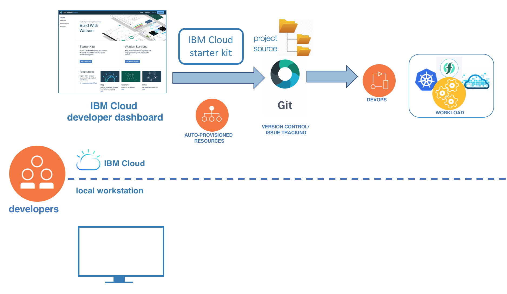

---

copyright:
  years: 2018, 2019
lastupdated: "2019-03-14"

keywords: cloud development, develop apps, build apps, continuous delivery, toolchain

subcollection: creating-apps

---

{:new_window: target="_blank"}
{:shortdesc: .shortdesc}
{:screen: .screen}
{:codeblock: .codeblock}
{:pre: .pre}
{:tip: .tip}
{:note: .note}

# Empfohlene Phasen der Cloudentwicklung
{: #development_process}

Cloud-App-Entwickler durchlaufen vier grundlegende Phasen des Entwicklungsprozesses: Einstieg, Codierung, Bereitstellung und Verwaltung. Das Ziel ist es, schnell eine funktionsfähige App zu erstellen und dann anhand des Feedbacks aus der Produktion den Code oder Bereitstellungszyklus immer wieder zu wiederholen, bis Ihre App bei den Benutzern ankommt.
{: shortdesc}

 Abbildung 1. Phasen des Entwicklungsprozesses

In manchen Fällen wird die Ausführung (`run`) als eine eigene Phase angesehen, aber im vorliegenden Fall kombinieren wir sie mit der Bereitstellungs- und der Verwaltungsphase.

Werfen wir einen genaueren Blick auf die beste Möglichkeit, {{site.data.keyword.cloud}} in Ihrem Entwicklungsprozess zu verwenden.

## Einstieg
{: #get_started}

Entwickeln Sie Ihre App in den {{site.data.keyword.cloud_notm}}-Entwicklerdashboards, in denen Sie ein Starter-Kit für Ihren Anwendungsfall und eine Programmiersprache auswählen können. {{site.data.keyword.cloud_notm}} verwendet Anweisungen aus dem Starter-Kit, um automatisch die erforderlichen Ressourcen zu erstellen und um eine sprachspezifische, laufzeitunabhängige App zu erstellen, die als Grundlage für Ihre Produktions-App dient. Klicken Sie zum Abschluss der Einstiegsphase im Entwicklerdashboard auf **In Cloud bereitstellen**. Mit einem Klick wird eine vollständige DevOps-Toolchain mit einem Code-Repository, das mit Ihrem App-Quellcode gefüllt ist, und einer Bereitstellungspipeline erstellt.

 Abbildung 2. Einstieg

Wenn Sie die Schaltfläche **In Cloud bereitstellen** verwenden, um Ihre DevOps-Toolchain einzurichten, wählen Sie Ihre Laufzeitplattform aus, z. B. Kubernetes oder Cloud Foundry. Die aus {{site.data.keyword.cloud_notm}} erzeugte Starter-Kit-App ist laufzeitunabhängig und muss nicht modifiziert werden.
{: tip}

## Lokal entwickeln
{: #develop_locally}

Nachdem Sie Ihre Starter-Kit-App und Ihre Toolchain erstellt haben, starten Sie Ihre Entwicklung lokal. Klonen Sie den Code aus Ihrem Repository und importieren Sie ihn in Ihre IDE. Verwenden Sie {{site.data.keyword.dev_cli_long}}, um Ihre Cloud-App auf Ihrer lokalen Maschine zu erstellen, auszuführen und zu testen. Die {{site.data.keyword.dev_cli_notm}} erstellen und verwalten lokale Container für Sie. Wenn Sie bereit sind, Ihre App in der Cloud auszuführen, führen Sie eine Push-Operation zu Ihrem Cloud-Repository durch und führen Sie Ihre Änderungen zusammen.

 Abbildung 3. Lokal entwickeln

Die grundlegenden Funktionen für {{site.data.keyword.dev_cli_notm}} sind `ibmcloud dev build` und `ibmcloud dev run`, doch die Befehlszeilenschnittstelle (CLI) hat noch sehr viel mehr zu bieten. Weitere Details finden Sie unter [{{site.data.keyword.dev_cli_notm}}](/docs/cli/index.html).
{: tip}

## In {{site.data.keyword.cloud_notm}} bereitstellen und verwalten
{: #deliver_and_manage}

Das Zusammenführen von Änderungen in Ihrem Cloud-Repository startet einen Erstellen-Bereitstellen-Zyklus in der DevOps-Toolchain, die Sie zuvor erstellt haben. Ihre App wird nach wenigen Minuten in der Cloud ausgeführt.

Den Status Ihrer DevOps-Pipeline können Sie im Delivery Pipeline-Dashboard prüfen. Den allgemeinen Status Ihrer App finden Sie im {{site.data.keyword.cloud_notm}}-Dashboard für Ihr Konto.
{: tip}

Die Toolchain, die in Ihrer Einstiegsphase erzeugt wird, verfügt über die grundlegenden Komponenten, die für eine interaktive, teambasierte Continuous Delivery erforderlich sind. {{site.data.keyword.cloud_notm}} bietet jedoch zusätzlich eine breite Auswahl von DevOps-Services, die Sie in Ihrer Toolchain hinzufügen können, um die Bereitstellung, Überwachung, Protokollierung und Alertausgabe zu verbessern.

 Abbildung 4. Bereitstellen und verwalten

Weitere Informationen zur [kontinuierlichen Entwicklung unter {{site.data.keyword.cloud_notm}}](/docs/services/ContinuousDelivery/index.html#cd_getting_started).

## Alles zusammenführen

 Abbildung 5. End-to-End-Entwicklungsprozess
