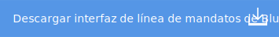

---
copyright:

  years: 2018

lastupdated: "2018-03-17"

---

{:new_window: target="_blank"}  
{:shortdesc: .shortdesc}  
{:screen: .screen}  
{:codeblock: .codeblock}  
{:pre: .pre}
{:tip: .tip}

# Despliegue de apps
{: #deploy}

Puede desplegar sus apps con una cadena de herramientas o con una interfaz de línea de mandatos. Una cadena de herramientas es un conjunto de integraciones de herramientas. La interfaz de línea de mandatos es una forma simple de desplegar sus apps e instancias de servicio.
{: shortdesc}

## Despliegue de apps con cadenas de herramientas
{: #toolchains_getting_started}

Las cadenas de herramientas abiertas están disponibles en los entornos Público y Dedicado en {{site.data.keyword.Bluemix}}. Puede crear una cadena de herramientas de dos maneras: utilizando una plantilla para crear la cadena de herramientas o creando una cadena de herramientas desde una app. Para obtener más información sobre las cadenas de herramientas, consulte [Creación de cadenas de herramientas](../services/ContinuousDelivery/toolchains_working.html#toolchains_getting_started).

Con una cadena de herramientas correctamente configurada, el despliegue de una app es trivial: se inicia un ciclo de despliegue de la compilación de forma automática con cada fusión en la rama maestra en su repositorio.

Todas las cadenas de herramientas creadas a partir de un panel de control de desarrollador de {{site.data.keyword.Bluemix}} se configurarán para un despliegue automático.
{: tip}

## Despliegue de apps con la interfaz de línea de mandatos
{: #cli}

IBM Cloud proporciona una CLI sólida así como plugins y extensiones de herramientas de desarrollador que se integran con la CLI.

Utilice la interfaz de línea de mandatos de {{site.data.keyword.Bluemix_notm}} para desplegar las apps y las instancias de servicio.
{:shortdesc}

Antes de empezar, descargue e instale la interfaz de línea de mandatos de {{site.data.keyword.Bluemix_notm}}.

**Restricción:** La herramienta de línea de mandatos no se admite en Cygwin. Utilice la herramienta en una ventana de línea de mandatos que no sea la ventana de Cygwin.
{:prereq}

Tras instalar la interfaz de línea de mandatos, ya puede empezar:

  1. {: download} Descargue el código de la app en un directorio nuevo para configurar su entorno de desarrollo.

    

  2. Cambie al directorio donde se encuentra el código.

  <pre class="pre"><code class="hljs">cd <var class="keyword varname">su_nuevo_directorio</var></code></pre>

  3.  Realice los cambios al código de su app. Por ejemplo, si utiliza una aplicación de ejemplo de {{site.data.keyword.Bluemix_notm}} y la app contiene el archivo `src/main/webapp/index.html`, puede modificarlo y editar "Thanks for creating ..." para que indique otra cosa. Asegúrese de que la app se ejecuta localmente
antes de volver a desplegarla en {{site.data.keyword.Bluemix_notm}}.

    Preste atención al archivo `manifest.yml`. Cuando despliegue su app nuevamente en
{{site.data.keyword.Bluemix_notm}}, este archivo se utiliza para determinar el URL de la aplicación, la
asignación de memoria, el número de instancias y otros parámetros cruciales.

    Preste también atención al archivo `README.md`, que contiene detalles como instrucciones de compilación, si procede.

    Nota: si la aplicación es una app Liberty, debe compilarla antes de volverla a desplegar.

  4. Conecte e inicie una sesión en {{site.data.keyword.Bluemix_notm}}.

  <pre class="pre"><code class="hljs">bluemix api https://api.NombreDominio</code></pre>

  <pre class="pre"><code class="hljs">bluemix login -u <var class="keyword varname" data-hd-keyref="user_ID">nombre_usuario</var> -o <var class="keyword varname" data-hd-keyref="org_name">nombre_organización</var> -s <var class="keyword varname" data-hd-keyref="space_name">nombre_espacio</var></code></pre>

  Si está utilizando un ID federado, utilice la opción `-sso`.

  <pre class="pre"><code class="hljs">bluemix login  -o <var class="keyword varname" data-hd-keyref="org_name">nombre_organización</var> -s <var class="keyword varname" data-hd-keyref="space_name">nombre_espacio</var> -sso</code></pre>

  **Nota**: Si el valor contiene un espacio, debe añadir comillas simples o dobles alrededor de `nombre_usuario`, `nombre_organización` y `nombre_espacio`, por ejemplo, `-o "my org"`.

  5. Desde <var class="keyword varname">nuevo_directorio</var>, vuelva a desplegar la app en {{site.data.keyword.Bluemix_notm}} mediante el mandato `bluemix app push`. Para obtener más información sobre el mandato `bx app push`, consulte [Carga de una aplicación](/docs/starters/upload_app.html).

  <pre class="pre"><code class="hljs">bluemix app push <var class="keyword varname" data-hd-keyref="app_name">nombre_app</var></code></pre>

  6. Acceda a su app navegando a https://<var class="keyword varname" data-hd-keyref="app_url">url_app</var>.NombreDominioApp.
