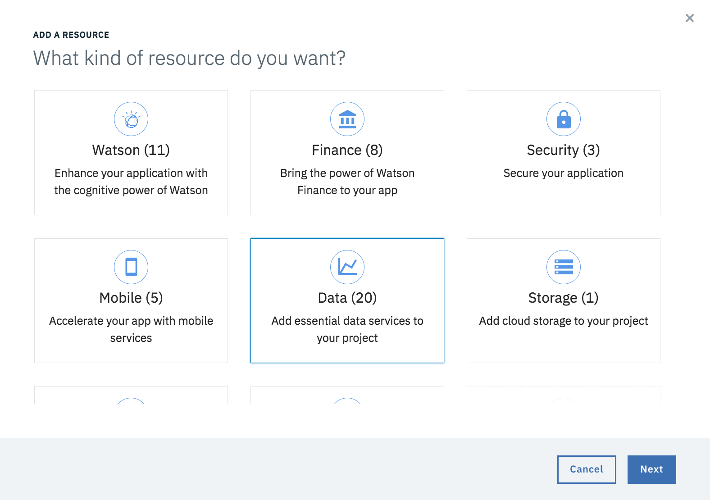

---

copyright:
  years: 2016, 2017, 2018
lastupdated: "2018-11-29"

---
{:new_window: target="_blank"}
{:shortdesc: .shortdesc}
{:screen: .screen}
{:codeblock: .codeblock}
{:pre: .pre}
{:tip: .tip}

# Guía paso a paso por la consola del desarrollador de {{site.data.keyword.cloud_notm}}
{: #intro}

<!--I can't see how a customer needs to be walked through the experience without performing a specific task.-->

La Experiencia de desarrollador de {{site.data.keyword.cloud}} permite a los desarrolladores de aplicaciones nativas de la nube crear una app a partir de diversos kits de inicio, crear y conectar servicios clave optimizados para {{site.data.keyword.Bluemix_notm}} y luego descargar rápidamente código en funcionamiento o configurar para la entrega continua. La Experiencia de desarrollador proporciona un conjunto de consolas del desarrollador de {{site.data.keyword.Bluemix_notm}} que le permiten crear, ver, configurar y gestionar su app, así como desplegarla en un conducto de devops o descargarla para el entorno local.

Si se crea una app mediante una consola del desarrollador de {{site.data.keyword.cloud_notm}}, todas las piezas necesarias de la app se mantienen bajo su cuenta en el servidor de {{site.data.keyword.cloud_notm}}.  Por lo tanto, puede moverse entre la GUI de la consola del desarrollador y la [{{site.data.keyword.dev_cli_notm}}](/docs/cli/idt/index.html) que elija para hacerlo.

Las consolas del desarrollador de {{site.data.keyword.cloud_notm}} le brindan un método sencillo para crear una app de inicio lista para producción para el caso de uso que seleccione.  Vamos a ver los pasos que puede realizar.

<!-- Ready to jump in?  Visit the [{{site.data.keyword.cloud_notm}} Web App developer console](https://{DomainName}/developer/appservice) to get started.
{: tip} -->

##Pantalla Visión general
{: #overview_screen}

La pantalla Visión general le proporciona un contenido adaptado al tema o al canal de la consola del desarrollador en el que esté trabajando. En la pantalla de visión general puede ver documentación, acceder a recursos de aprendizaje, examinar servicios, ver kits de inicio destacados o enlazar con una colección más amplia de kits de inicio. Pulse `Kits de inicio` en la navegación para entrar en la vista Kits de inicio.

   *Pantalla Visión general de la consola del desarrollador*

##Vista Kits de inicio
{: #starter_kits_view}

La vista Kits de inicio muestra la colección de kits de inicio específicos de un área de casos de uso.  Puede pulsar varios enlaces de una tarjeta de kit de inicio para ver demostraciones y más información.  Seleccione un kit de inicio para ir a la vista Crear nueva app.

En algunos casos, la selección de un kit de inicio le lleva a conocer más detalles sobre el kit de inicio.  Si ese es el caso, simplemente pulse el botón `Crear` para ir a la vista Crear nueva app.{: tip}

   *Vista Kits de inicio de la consola del desarrollador*

##Vista Crear nueva app
{: #create_new_project_view}

En la vista Crear nueva app, puede dar nombre a la app, proporcionar información de despliegue y de direccionamiento y seleccionar un idioma.  Observe a la derecha que también puede ver los servicios que se suministrarán automáticamente al crear la app, junto con los planes de precios y las condiciones de cada uno.  Pulse `Crear` para ir a la vista Detalles de la app.  Si todavía no ha iniciado sesión en {{site.data.keyword.cloud_notm}}, tiene que hacerlo en este punto.

   *Vista Crear nueva app de la consola del desarrollador*

## Vista Detalles de la app
{: #project_details_view}

La vista Detalles de la app muestra una lista de los servicios que se han configurado para la app. Para cada elemento de la lista puede ver el nombre del servicio, enlaces con más información y un botón *acciones* con tres puntos alineados verticalmente. Las opciones del botón *acciones* sirven para eliminar un servicio de la app, abrir el panel de control de un servicio y suprimir un servicio. Tenga en cuenta que al eliminar una instancia de servicio solo se elimina la asociación con esta app, no se suprime la instancia de servicio.  Observe también que las credenciales de servicio se consolidan en esta vista para que no tenga que ir a la vista de cada instancia de servicio individual para obtenerlas.

   *vista Detalles de la app de la consola del desarrollador*

La vista Detalles de la app también le permite añadir servicios nuevos o existentes a la app que no formaban parte del kit de inicio original. Pulse el enlace `Añadir recurso` en el recuadro de lista de servicios para hacerlo.  Los servicios disponibles dependen del tipo de app y de los servicios que están disponibles en una región, por lo que no todos los servicios se pueden asociar a todas las apps.

   *Diálogo Añadir recurso de la consola del desarrollador*

En la vista Detalles de la app puede acceder a su código de dos maneras:

*  [Recomendado] Pulse el botón `Desplegar en la nube` para enviar por push el código a un repositorio y desplegar la app en {{site.data.keyword.cloud_notm}}.  Para obtener más información sobre la cadena de herramientas de DevOps de {{site.data.keyword.cloud_notm}}, pulse [aquí](/docs/services/ContinuousDelivery/toolchains_about.html#toolchains_about).
*  Para echar un vistazo rápido al código de su app, seleccione `Descargar código` para generar y descargar el código de la app.

##Vista Lista de apps
{: #project_list_view}

Puede ver una lista de todas las apps que ha creado en la vista Lista de apps.  Puede cambiar el nombre o suprimir las apps desde aquí. Pulse una fila de nombre de app para volver a la vista Detalles de la app.

   *Vista Lista de apps de la consola del desarrollador*
