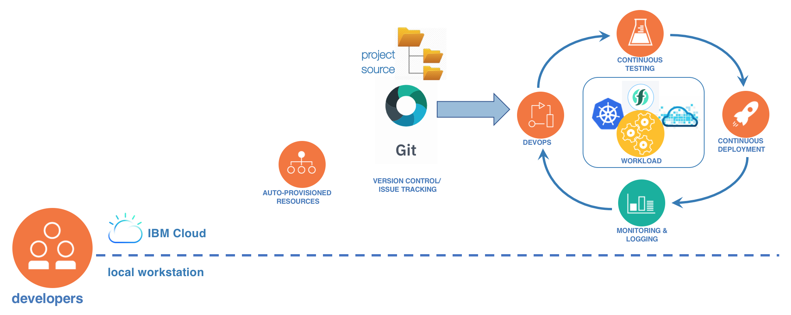

---

copyright:
  years: 2018
lastupdated: "2018-11-29"

---

{:new_window: target="_blank"}
{:shortdesc: .shortdesc}
{:screen: .screen}
{:codeblock: .codeblock}
{:pre: .pre}
{:tip: .tip}
{:note: .note}

# クラウド開発の推奨フェーズ
{: #development_process}

クラウド・アプリの開発者は、開発プロセスの基本的な 4 つのフェーズ (開始、コーディング、デリバリー、管理) を移動していきます。 目標は、実用的なアプリを時間をかけずに生成し、その後、実動アプリからのフィードバックを使用して、アプリがユーザーの共感を得るまで、継続的にコーディングとデリバリーのサイクルを繰り返すことです。
{: shortdesc}

 図 1. 開発プロセスのフェーズ

場合によっては「`実行`」が別個のフェーズとされることがありますが、ここではデリバリー・フェーズおよび管理フェーズに組み合わせています。

開発フローで {{site.data.keyword.cloud}} を使用する最良の方法を詳しく見ていきます。

## 開始
{: #get_started}

{{site.data.keyword.cloud_notm}} 開発者ダッシュボードでアプリをビルドします。そこで、ユーザーのユース・ケースに関連するスターター・キットを選択し、プログラミング言語を選択することができます。 {{site.data.keyword.cloud_notm}} は、スターター・キットからの指示を使用して、必要なリソースを自動的に作成し、実動アプリの基礎となる言語固有でランタイムに依存しないアプリを作成します。 開始フェーズを完了するには、開発者ダッシュボードから**「クラウドにデプロイ (Deploy to Cloud)」**をクリックします。 1 回のクリックで、アプリのソース・コードとデプロイメント・パイプラインが設定されたコード・リポジトリーを備えた、DevOps ツールチェーンが作成されます。

 図 2. 開始フロー

**「クラウドにデプロイ」**ボタンを使用して DevOps ツールチェーンをセットアップするときに、Kubernetes や Cloud Foundry などのランタイム・プラットフォームを選択します。 {{site.data.keyword.cloud_notm}} から生成されたスターター・キット・アプリは、ランタイムに依存せず、変更する必要はありません。
{: tip}

## ローカルで開発
{: #develop_locally}

スターター・キット・アプリとツールチェーンを作成した後、ローカルで開発を始めます。 リポジトリーからローカルのワークステーションにコードを複製し、IDE にインポートします。 {{site.data.keyword.dev_cli_long}}を使用して、ローカル・マシン上でクラウド・アプリのビルド、実行、テストを行います。 {{site.data.keyword.dev_cli_notm}}は、ローカル・コンテナーを作成し、管理します。 アプリをクラウド上で実行する準備ができたら、変更をクラウド・リポジトリーにプッシュしてマージします。

 図 3. ローカルで開発のフロー

{{site.data.keyword.dev_cli_notm}}の基本機能は `ibmcloud dev build` と `ibmcloud dev run` ですが、CLI ははるかに多くを提供しています。 詳しくは、『[{{site.data.keyword.dev_cli_notm}}](/docs/cli/index.html#overview)』を参照してください。
{: tip}

## {{site.data.keyword.cloud_notm}} でのデリバリーおよび管理
{: #deliver_and_manage}

クラウド・リポジトリーに変更をマージすると、以前に作成した DevOps ツールチェーンでビルドとデプロイメントのサイクルが開始されます。 数分後にはアプリがクラウドで実行されています。

DevOps パイプラインの状況を確認するには、Delivery Pipeline ダッシュボードを使用します。 アプリの全体的な状況を確認するには、アカウントの {{site.data.keyword.cloud_notm}} ダッシュボードを参照してください。
{: tip}

開始の段階で生成されるツールチェーンには、共同作業となるチームベースの継続的デリバリーのために必要な基本コンポーネントが含まれます。 しかし、{{site.data.keyword.cloud_notm}} では、デリバリー、モニタリング、ロギング、警告を強化するために、ツールチェーンに追加できる DevOps サービスの広範なセットを提供しています。

 図 4. デリバリーおよび管理のフロー

詳細は、[{{site.data.keyword.cloud_notm}} での継続的開発](/docs/services/ContinuousDelivery/index.html#cd_getting_started)を参照してください。

## すべてをまとめる

 図 5. エンドツーエンド開発プロセス
