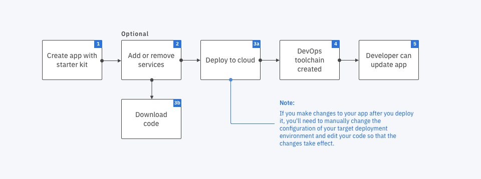

---

copyright:
  years: 2018
lastupdated: "2018-11-26"

---

{:shortdesc: .shortdesc}
{:new_window: target="_blank"}
{:codeblock: .codeblock}
{:pre: .pre}
{:screen: .screen}
{:tip: .tip}

# Kubernetes 클러스터에 스타터 킷 앱 배치
{: #tutorial}

공백 스타터 킷과 Kubernetes 도구 체인을 사용하여 {{site.data.keyword.cloud}}에서 앱을 작성하고 Kubernetes 클러스터의 안전한 컨테이너로 앱을 지속적으로 전달하는 방법에 대해 알아봅니다. 코드 변경사항이 자동으로 빌드되고 Kube 클러스터에 있는 앱에 전파되도록 지속적 통합 DevOps 파이프라인을 구성할 수 있습니다. 파이프라인이 이미 있으면 이를 앱에 연결할 수 있습니다.
{: shortdesc}

{{site.data.keyword.cloud_notm}}에서는 Kubernetes에서 실행되는 앱의 기초를 빌드하는 데 도움이 되는 스타터 킷을 제공합니다. 스타터 킷을 사용하면 앱 개발에 {{site.data.keyword.cloud_notm}} 우수 사례를 사용하는 클라우드 고유 프로그래밍 모델을 따르기가 쉽습니다. 스타터 킷은 클라우드 고유 프로그래밍 모델을 따르는 앱을 생성하며, 이에는 각 프로그래밍 언어의 메트릭 및 테스트 케이스, 상태 검사가 포함됩니다. 생성된 애플리케이션에서 다시 초기화되는 클라우드 서비스를 프로비저닝할 수도 있습니다. 

이 튜토리얼에서는 Kubernetes 배치 옵션을 사용합니다. 이 튜토리얼에서는 Java + Spring을 사용하고 Cloudant 서비스 인스턴스를 이에 추가한 후에 Kubernetes 환경을 사용하여 이를 {{site.data.keyword.cloud_notm}}에 배치하여 기본 스타터 킷에서 애플리케이션을 작성합니다. 

우선 다음의 스타터 킷 플로우 다이어그램과 해당되는 개요 단계를 보십시오. 

 

## 시작하기 전에
{: #prereqs}

* [스타터 킷](/docs/apps/tutorials/tutorial_starter-kit.html)을 사용하여 **Java + Spring** 앱을 작성하십시오. 
* [{{site.data.keyword.cloud_notm}} CLI](/docs/cli/index.html)를 설치하십시오. 
* [Docker ](https://www.docker.com/get-started){: new_window}를 설정하십시오. 

## 앱에 리소스 추가
{: #add_resources}

{{site.data.keyword.cloud_notm}} 서비스 리소스를 애플리케이션에 추가하십시오. 다음 단계는 Cloudant 인스턴스를 프로비저닝하고 리소스 키(인증 정보)를 작성하며 이를 앱에 바인드합니다. 

1. **앱 세부사항** 페이지에서 **리소스 추가**를 클릭하십시오. 
2. **데이터**를 선택하고 **다음**을 클릭하십시오. 
3. **Cloudant**를 선택하고 **다음**을 클릭하십시오. 
4. **Cloudant 추가** 페이지에서 지역(미국 남부), 리소스 그룹(기본값) 및 가격 플랜(Lite - 1개의 무료 인스턴스)을 선택하십시오. 
5. **작성**을 클릭하십시오. **앱 세부사항** 페이지가 표시되고 Cloudant 인스턴스가 프로비저닝되며 앱에 바인딩됩니다. 참고로, Cloudant 리소스 키(인증 정보)는 **인증 정보** 필드에 추가됩니다. 
6. 선택사항. 리소스를 추가한 후에 앱을 간략히 보려면 **코드 다운로드**를 클릭하십시오. 코드가 전체 앱 코드 구조가 포함된 `.zip` 파일로 다운로드됩니다. {{site.data.keyword.dev_cli_notm}}을 사용하여 파일을 쉽게 추출하고 로컬로 코드를 실행하거나 코드 관리 저장소에 추가할 수 있습니다.

## DevOps 도구 체인을 사용하여 앱 배치
{: #deploy_app}

애플리케이션에 DevOps 도구 체인을 연결하고 {{site.data.keyword.cloud_notm}} Kubernetes 서비스에서 호스팅된 Kubernetes 클러스터에 배치되도록 이를 구성하십시오. 

1. **앱 세부사항** 페이지에서 **클라우드에 배치**를 클릭하십시오. 
2. **배치 환경 선택** 페이지에서 **Kubernetes에 배치**를 선택하십시오. 
3. 지역 및 클러스터를 선택하십시오. Kubernetes 클러스터가 없으면 **클러스터 작성**을 클릭하십시오. 
  * **새 클러스터 작성** 페이지에서 위치, 클러스터 유형(무료)을 선택하고 클러스터 이름을 입력한 후 **클러스터 작성**을 클릭하십시오. 
  * 필요하면 화면의 지시사항에 따라 클러스터에 대한 액세스 권한을 받으십시오. 
  * 도구 체인을 작성하려면 클러스터가 **준비**를 표시할 때까지 대기하십시오. **미국 남부** 지역에서는 1개의 무료 클러스터를 프로비저닝할 수 있습니다. 
  * **배치 환경 선택** 페이지로 돌아가십시오. 
4. **다음**을 클릭하십시오. **도구 체인 구성** 페이지가 표시됩니다. 
5. **도구 체인 구성** 페이지에서 도구 체인 이름을 입력하고 지역을 선택하며 리소스 그룹을 선택한 후 **작성**을 클릭하십시오. 도구 체인에 대한 배치 정보와 함께 **앱 세부사항** 페이지가 표시됩니다. 

## 저장소 보기
{: #view_repo}

1. **앱 세부사항** 페이지에서 **저장소 보기**를 클릭하십시오. 스타터 킷이 생성한 Git 저장소가 표시됩니다. 
2. 선택사항. 화면의 지시사항에 따라 데스크탑에서 SSH를 구성하십시오. 
3. 선택사항. 화면의 지시사항에 따라 계정에서 개인 액세스 토큰을 작성하십시오. 

## 도구 체인 도구, 로그 및 히스토리 보기
{: #view_logs}

1. 배치 단계가 완료되면 도구 체인에 대한 배치 정보와 함께 **앱 세부사항** 페이지가 표시됩니다. 
2. **도구 체인 보기**를 클릭하여 도구 체인에 액세스하십시오. 도구 체인 페이지의 **개요** 탭이 표시되며, 이는 도구 체인에 포함된 도구를 표시합니다. 이 예에는 도구 체인이 작성되었을 때 스타터 킷에서 사전 선택된 다음 도구가 포함됩니다. 
  * 프로젝트 업데이트와 변경사항을 추적하기 위한 문제 트래커. 
  * 애플리케이션의 소스 코드가 포함된 Git 저장소. 
  * 애플리케이션을 편집하기 위한 웹 기반 IDE인 Eclipse Orion 인스턴스. 
  * 사용자 정의할 수 있는 빌드 및 배치 단계로 구성된 Delivery Pipeline. 
	 * 빌드 단계는 앱을 컨테이너화합니다. 보다 구체적으로 빌드 단계는 다음을 수행합니다. 
	   * GitLab 저장소를 복제합니다. 
	   * 앱을 빌드합니다. 
	   * Docker 이미지를 빌드합니다. 
	   * 이미지를 개인용 컨테이너 레지스트리에 공개합니다. 
	 * 배치 단계는 컨테이너 레지스트리에서 컨테이너 이미지를 검색한 후 이를 Kubernetes 클러스터에 배치합니다. 
3. **Delivery Pipeline**을 클릭하십시오. 파이프라인 단계가 표시됩니다. 
4. 배치 단계에서 **로그 및 히스토리 보기**를 클릭하십시오.
5. 로그의 끝에서 다음을 찾으십시오. `VIEW THE APPLICATION AT: http://<ipaddress>:<port>`. 이는 애플리케이션에 액세스할 수 있는 URL입니다. 
6. 다음의 `/health` 엔드포인트로 이동하십시오. `http://<ipaddress>:<port>/health`. 애플리케이션이 클러스터에서 실행 중이면 `{"status":"UP"}`이 포함된 메시지가 표시됩니다. 

배치에서 오류가 발생하면 [스토리지 할당양 초과](/docs/apps/ts_apps.html#exceed_quota) 등의 알려진 문제에 대해 문제점 해결 주제를 확인하거나 [Kubernetes 로그에 액세스](/docs/apps/ts_apps.html#access_kube_logs)하여 오류를 찾는 방법에 대해 알아보십시오. 

## 다음 단계
{: #next_steps notoc}

* 코드에서 서비스 구성에 액세스:
	- _@Value_ 어노테이션을 사용하거나 Spring 프레임워크 환경 클래스 _getProperty()_ 메소드를 사용할 수 있습니다. 자세한 정보는 [인증 정보에 액세스](/docs/java-spring/configuration.html#configuration#accessing-credentials)를 참조하십시오. 

* Kubernetes 환경에 인증 정보 새로 추가:
	- DevOps 도구 체인이 작성된 후에 다른 서비스를 애플리케이션에 추가하는 경우, 해당 서비스 인증 정보는 배치된 애플리케이션 및 GitLab 저장소로 자동으로 업데이트되지 않습니다. 사용자가 직접 배치 환경에 [인증 정보를 수동으로 추가](/docs/apps/creds_kube.html#sk_kube)해야 합니다. 
