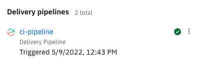

---

copyright:
   years: 2021
lastupdated: "2021-08-26"

keywords: tekton, pipeline, toolchain, CD, CI, Terraform, template, automate, automation, compliance, secure, compliant, shift-left, shift left, quick start, devsecops tutorial, devsecops

subcollection: apps

content-type: tutorial
services: schematics, terraform, openshift, containers, ContinuousDelivery, apps
account-plan: paid
completion-time: 1h

---

{:shortdesc: .shortdesc}
{:screen: .screen}  
{:codeblock: .codeblock}  
{:pre: .pre}
{:tip: .tip}
{:note: .note}
{:important: .important}
{:external: target="_blank" .external}
{:step: data-tutorial-type='step'}

# Set up your DevSecOps infrastructure and CI toolchain for deploying a secure app
{: #tutorial-apps-devsecops}
{: toc-content-type="tutorial"}
{: toc-services="schematics, terraform, openshift, containers, ContinuousDelivery, apps"}
{: toc-completion-time="1h"}

Use this tutorial for automated setup of the infrastructure for your CI and CD toolchains by using a Terraform-based quick start template. The template uses DevSecOps best practices of compliance and security. The template uses an [{{site.data.keyword.bplong}} workspace](/docs/schematics?topic=schematics-about-schematics), which automates the creation of the required infrastructure for securely deploying your app to either Kubernetes or Red Hat&reg; OpenShift&reg;. The template uses the DevSecOps {{site.data.keyword.contdelivery_full}} toolchain pipeline structure. The toolchain is preconfigured for continuous delivery with inventory integration, change management, evidence collection, and deployment.
{: shortdesc}

{{site.data.keyword.bplong_notm}} delivers Terraform-as-a-Service so that you can use a high-level scripting language to model the resources that you want in your {{site.data.keyword.cloud_notm}} environment, and enable Infrastructure as Code (IaC). [Terraform](https://www.terraform.io/){: external} is an open source software that is developed by HashiCorp that enables predictable and consistent resource provisioning to rapidly build complex, multitier cloud environments.

In this tutorial, you follow three easy steps to create a {{site.data.keyword.bpshort}} workspace, apply a Terraform execution plan, and update the environment properties value. When you apply the plan, the {{site.data.keyword.bpshort}} workspace sets up your secure infrastructure. This infrastructure is shareable with your team, and it works for the DevSecOps CI and CD toolchain templates.

The automated infrastructure setup creates resources that are automatically provisioned by using the default values from the DevSecOps CI and CD templates. You can find the default values in the **Variables** section of the {{site.data.keyword.bpshort}} workspace. The following resources are created:

* A cluster in [{{site.data.keyword.containerlong}}](/docs/containers?topic=containers-clusters) or [Red Hat OpenShift on {{site.data.keyword.cloud_notm}}](/docs/openshift?topic=openshift-getting-started). If you already have a free or paid cluster and want to use it for this tutorial, you can override the `cluster_name` default value in [step 2](#devsecops-apply-plan). If you use an existing cluster, the time frame for completing this tutorial is reduced by 20-30 minutes.
* [A standard {{site.data.keyword.cos_full_notm}} instance and bucket](/docs/cloud-object-storage?topic=cloud-object-storage-about-cloud-object-storage). If you already have a Lite {{site.data.keyword.cos_full_notm}} instance and bucket and want to use those resources, you can override the default values for `cos_instance_name` and `cos_bucket_name` in [step 2](#devsecops-apply-plan).
* [{{site.data.keyword.secrets-manager_full}}](/docs/secrets-manager?topic=secrets-manager-getting-started). Note that only one {{site.data.keyword.secrets-manager_short}} instance is permitted. If you already have a {{site.data.keyword.secrets-manager_short}} service, be sure to override the `sm_service_name` default value in [step 2](#devsecops-apply-plan).
* [GPG image signing key](/docs/ContinuousDelivery?topic=ContinuousDelivery-cd-devsecops-image-signing).
* A fully functional [DevSecOps CI toolchain](/docs/ContinuousDelivery?topic=ContinuousDelivery-tutorial-cd-devsecops#devsecops-ci-toolchain-intro) that builds, tests, and deploys a sample Node.js application by using DevSecOps best practices of compliance and security.

## Before you begin
{: #apps-devsecops-prereqs}

* To complete this tutorial, use a [Pay-As-You-Go or Subscription {{site.data.keyword.cloud_notm}} account](/docs/account?topic=account-upgrading-account) where you are the owner or have [full Administrator access](/docs/account?topic=account-assign-access-resources).
* [Install the {{site.data.keyword.cloud_notm}} CLI](/docs/cli?topic=cloud-cli-getting-started) if you want to interact with elements of the toolchain or infrastructure after they are created.
* Obtain a [GitLab Personal Access Token](https://us-south.git.cloud.ibm.com/-/profile/personal_access_tokens){: external}. Enter a name for your personal access token. Create your token in the same region as your CI toolchain. Be sure to copy and save the token because you need it later, and you cannot access it again.
* Create an [{{site.data.keyword.cloud_notm}} API key](https://cloud.ibm.com/iam/apikeys){: external}. Be sure to copy and save or download the API key value because you need it later, and you cannot access it again.

## Create a {{site.data.keyword.bpshort}} workspace
{: #devsecops-schematics-workspace}
{: step}

1. Click one of the following options for the cluster deployment target. This action takes you to the "Deploy to {{site.data.keyword.cloud_notm}}" page where you create a {{site.data.keyword.bpshort}} workspace. Complete the required fields on that page, and then click **Next**.

  {: external}
  {: external}

  Based on which option you select, the corresponding Terraform template from this repository is automatically imported into the new {{site.data.keyword.bpshort}} workspace.
  {: note}

1. Verify the information, and then click **Create**. The {{site.data.keyword.bpshort}} workspace is created, and the Settings page for the {{site.data.keyword.bpshort}} workspace is displayed.

## Apply the Terraform execution plan
{: #devsecops-apply-plan}
{: step}

1. In the **Variables** section of the {{site.data.keyword.bpshort}} Settings page, enter the values for each variable. Required fields don't have default values. You can override default values.

   If you override any of the following values, the Terraform execution plan uses the existing resources instead of creating new resources: `cluster_name`, `cos_instance_name`, `cos_bucket_name`, or `sm_service_name`.
   {: important}

1. For the `gitlab_token` variable, enter the personal access token that you obtained previously.
1. For the `ibmcloud_api_key` variable, enter the {{site.data.keyword.cloud_notm}} API key that you obtained previously.
1. For the `registry_namespace` variable, enter a container registry namespace value. To create a namespace, see [Container Registry Namespaces](https://{DomainName}/registry/namespaces).{: external}
1. Optional. If you already have a {{site.data.keyword.secrets-manager_short}} instance, enter it name for the `sm_service_name` variable. Otherwise, don't change this variable.
1. Optional. If you already have a cluster and want to use it for this tutorial, you can override the `cluster_name` default value. If you override the `cluster_name` default value, you don't need to provide values for the following variables: `datacenter`, `default_pool_size`, `machine_type`, `hardware`, `kube_version`, `public_vlan_num`, or `private_vlan_num`.
1. Optional. Click **Generate plan**. This action creates a Terraform execution plan and checks your configuration for syntax errors. On the {{site.data.keyword.bpshort}} Jobs page, you can review log files for errors and {{site.data.keyword.cloud_notm}} resources that must be created, modified, or deleted to achieve the correct state of the Terraform template.
1. After you enter all the values for the variables and are satisfied with the changes, click **Apply plan** to run your infrastructure code. 
   This step takes some time to complete (usually 20 - 30 minutes, but it can take longer), due to the creation of a new Kubernetes or OpenShift cluster. If you use an existing cluster, this step takes only a few minutes.
   {: note}
1. On the {{site.data.keyword.bpshort}} Jobs page, you can view the log by expanding the job name.
1. After the plan is applied, view the URL to the generated {{site.data.keyword.cloud_notm}} DevSecOps CI toolchain. The URL is located near the end of the log file on a line that begins with "View the toolchain at:."

If you apply your plan a second time, the previously created Kubernetes or OpenShift cluster and any applications that are deployed to it are deleted, and a new cluster is created. However if you override the default cluster name, that cluster is used.
{: important}

## Update the environment properties value
{: #devsecops-env-value}
{: step}

After the DevSecOps CI toolchain is created in the previous step, follow these steps to update the **ci-pipeline** Delivery Pipeline before you run it.

{: caption="Figure 1. The ci-pipeline Delivery Pipeline." caption-side="bottom"}

1. Open the DevSecOps CI toolchain in a browser.
1. Click the Delivery Pipeline tile for your **ci-pipeline**.
1. Select **Environment properties** in the navigation menu.
1. Click the **Edit** icon  for the `vault-secret` property.
1. In the **Edit property** window, click the **Key** icon . A **Secure property** window is displayed, and the provider is automatically refreshed with your Secrets Manager information.
1. In the **Secret name** dropdown, select `GPG_Key`, and click **OK**.
1. In the **Edit property** window, click **Save**. The value is added to the `vault-secret` property.

{: caption="Figure 2. The value is added to the vault-secret property." caption-side="bottom"}

Now that the value is updated, follow these steps to run the pipeline.
1. Click **Run Pipeline**.
1. On the Run Pipeline page, click **Run**.
1. When you see a message about a new pipeline run being triggered, click **View the PipelineRun**. This process takes a while to complete, and you can view the log files for each stage of the pipeline run.

## Related information
{: #devsecops-related}

For more information about this workflow, see [Getting started with {{site.data.keyword.bplong_notm}} and Terraform](/docs/schematics?topic=schematics-getting-started).

For {{site.data.keyword.bpshort}} troubleshooting information, see [How can I find the root cause of why Schematics apply is failing?](/docs/schematics?topic=schematics-nullresource-errors).

## Next steps
{: #devsecops-next-steps}

Continue to the "[Explore your CI toolchain](/docs/ContinuousDelivery?topic=ContinuousDelivery-tutorial-cd-devsecops#devsecops-ci-toolchain-explore)" section of the [next tutorial](/docs/ContinuousDelivery?topic=ContinuousDelivery-tutorial-cd-devsecops), and run the CI-PR and CI pipelines. Then, continue through the remainder of the steps in that tutorial to deploy a secure app.

At any time, you can view all the resources that were created with this tutorial by clicking the **Menu** icon  and selecting **Resource list**. You can view your {{site.data.keyword.bpshort}} workspace, cluster, {{site.data.keyword.cos_full_notm}} instance, Secrets Manager service, continuous delivery service, and toolchain.
